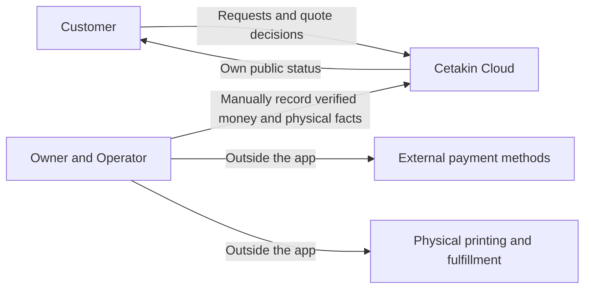
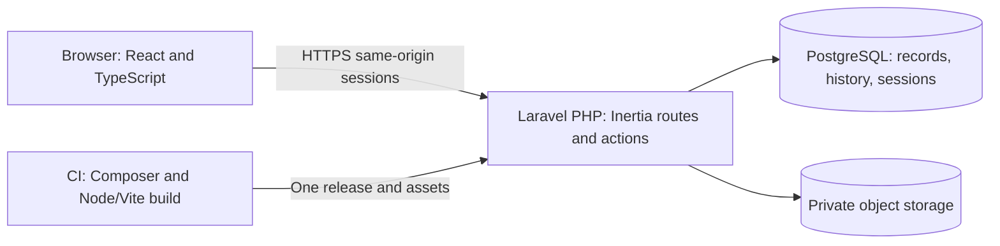
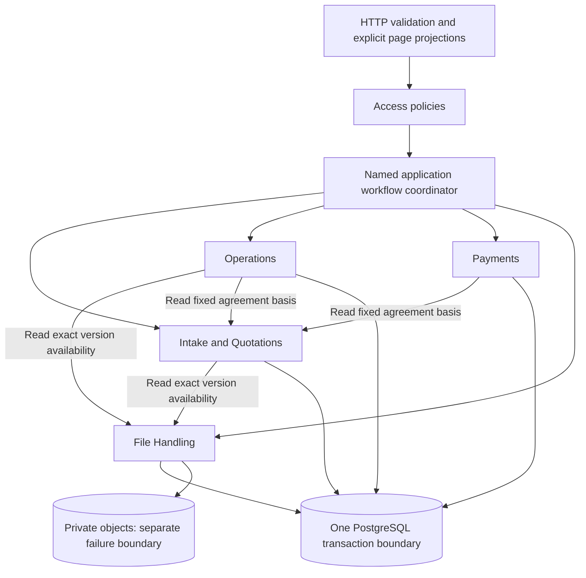

# Cetakin Cloud Architecture

**Status: Proposed for human review.** Recommendations follow `AGENTS.md`, `README.md`, `VISION.md`, the reduced `PRD.md` and `DOMAIN.md`. This document and seven proposed ADRs are the only changes. No application, dependencies, containers or infrastructure have been initialized. Business decisions BD-01–17 retain their existing gates; choosing technology resolves none of them.

## 1. Architectural principles

Build a production-oriented modular monolith around a complete custom-print workflow. Prefer one application, one authoritative relational database and explicit business actions over distributed coordination. Portfolio evidence should come from authorization, domain correctness, failure handling, tests and recovery, rather than component count.

Protect exact agreements/files, actual production outcomes and retained money evidence. Keep physical fulfillment, financial settlement and closure distinct. Manual operational decisions remain manual; no architecture should silently invent payment timing, cancellation charges or change policies.

Use ordinary framework facilities before custom abstractions. Add a component only for a measured need or an approved requirement. Maintainability means someone can understand, operate, test and restore the business workflow.

## 2. Application architecture comparison

| Dimension | A: Laravel + React/TypeScript through Inertia | B: Laravel REST API + separate Next.js frontend |
| --- | --- | --- |
| Complexity / maintenance | One codebase, server routing, session boundary and application release. PHP and frontend builds still require maintenance. | Explicit API contracts, two routing/error layers and application releases; SSR adds Node operations when used. |
| Authentication / authorization | Same-origin session/CSRF; Laravel owns all business authorization. | Browser/API identity integration needed. Separate origins require explicit CORS/cookie/CSRF decisions; a same-origin gateway can avoid CORS but adds coordination. |
| Testing | Domain/HTTP integration plus React/browser tests; fewer transport contracts. | Same business tests plus API contracts, frontend/API integration and deployment-version compatibility. |
| Deployment | PHP runtime serves app and compiled assets; Node only builds assets when SSR is disabled. | PHP backend plus frontend deployment; Next SSR needs a Node runtime, while static export reduces runtime needs but constrains features. |
| UX / performance | React interactivity sufficient for forms, review and status work. Laravel supplies page data. | Independent frontend/SSR can help public content or specialized UX; current private workflow provides no demonstrated need. |
| Portfolio / developer experience | Demonstrates React, server-side authorization, transactions and business engineering without duplicated plumbing. | Demonstrates API integration and independent clients, but more infrastructure is not inherently better portfolio evidence. |
| API / Flutter future | Add a deliberate API over existing business actions if a real client appears. Inertia responses are not that API. | API already exists, but mobile identity, public contracts and versioning still require deliberate work. |
| Scaling | App instances can grow later using shared sessions/database/private storage; starts as one instance. | Frontend and backend can scale separately, with additional operational complexity. No current demand justifies it. |

**Recommend A**, with no Inertia SSR initially. Current scope contains no independent API consumer, native app or public storefront/SEO requirement. Inertia integrates client pages with server routes; optional SSR introduces additional runtime work, so omit it here. [Inertia server setup](https://inertiajs.com/docs/v3/installation/server-side-setup), [SSR documentation](https://inertiajs.com/docs/v3/advanced/server-side-rendering).

A Blade/Livewire application is also business-capable and could reduce JavaScript maintenance. Recommend A only if the maintainer can support React/TypeScript: reusable interactive intake/review forms and focused client tests can then fit existing skills while server routing stays unified. Blade/Livewire is the smaller alternative if that capacity is absent. Portfolio practice alone does not justify extra technology; confirm maintainability before adopting ADR-002.

Proposed stack: supported compatible Laravel/PHP, React/TypeScript, Inertia and Vite; PostgreSQL; private S3-compatible production storage. Select supported compatible versions and commit dependency locks only when implementation is authorized. Do not pin guessed versions or adopt every starter-kit feature. See ADR-001/002.

## 3. Backend modules and layers

Five internal responsibility areas are sufficient; they are not services or separate deployments.

| Module | Owns | Does not own |
| --- | --- | --- |
| Access | Minimal Customer identity/contact, actor-to-customer access mappings, fixed staff responsibilities, task permissions, grants/revocation | CRM, business agreement or payment verification |
| Intake & Quotations | Requests, review/clarification, identified specifications, quote versions and acceptance evidence | Physical production or money events |
| Operations | Orders, jobs/reprints, assignment, holds, usable output, fulfillment/cancellation/closure | Editing issued quotes or recording receipts |
| Payments | Verified external-money events, approved corrections, disputes and derived summaries | Payment processing or physical order transitions |
| File Handling | Private bytes, version/provenance metadata, availability and policy-compliant deletion/recovery | Printability guarantees or agreed-scope substitution |

Thin HTTP controllers perform request mapping; validation checks input shape; policies enforce current access. Named application actions such as AcceptQuotation, StartPrintJob or RecordReceipt coordinate domain guards and persistence. Small domain helpers/value objects clarify Money, Quantity and fixed specification semantics where useful. Eloquent is the ordinary relational mapper; avoid a generic repository/interface/service layer for every entity.

Modules own their writes and expose narrow actions/read projections. Cross-workflow application coordinators call these capabilities under one transaction owner; modules do not call each other in cycles or commit partial outcomes independently. Domain rules do not depend on React/HTTP. Shared concepts remain small, without a generic platform package. Boundaries can begin as namespaces/conventions with focused checks rather than separately packaged frameworks.

Permitted dependencies are explicit: the coordinator obtains current actor/grant context from Access; Access evaluates authoritative ownership context without invoking business mutations. Intake and Operations consume File Handling's read-only version/availability capability; Operations and Payments consume Intake's read-only fixed agreement basis. Mutable cross-module changes go through named module actions under the coordinator. Payments cannot write Operations state, Files cannot write agreed scope, and HTTP/components cannot update persistence directly. No reverse mutation calls or cyclic imports; projections may compose read capabilities without gaining write authority.

## 4. Cross-domain consistency

Use short PostgreSQL transactions, shared coordination locks and constraints for guarded outcomes. Database capability does not supply business policy automatically. [Laravel transaction support](https://laravel.com/framework/docs/database#database-transactions), [PostgreSQL row locks](https://www.postgresql.org/docs/current/explicit-locking.html#LOCKING-ROWS).

| Action | One committed business outcome |
| --- | --- |
| Initial acceptance | Lock the originating Request/current proposal; recheck ownership, sufficient review, current version/deadline and exact available files. Retain acceptance, create one linked Order/initial payable basis, mark Request converted and record history together. Rollback is no success; lost-response retry retrieves the existing result. |
| Supported amendment issue/acceptance | Coordinate on the Request and **same Order lock used by every job-start action**. Recheck queued, no job ever actually started—including failed/cancelled history—current prior basis, one eligible proposal and hold. Acceptance retains prior agreement, updates the same Order/payable basis, and blocks obsolete queued jobs together. No changed work until jobs are corrected and release rechecked. |
| Job start / readiness / cancellation | Lock Order before job changes; verify current agreement/files, current authorization, release/holds and terminal boundaries. Job start and order production state agree. Readiness requires verified usable output/all jobs terminal. Cancellation confirms actual stops, cancels queued work and retains physical/financial responsibility. |
| Money / fulfillment / closure | Coordinate Order/current basis and Payment Record where needed; append verified event/correction once. Fulfillment remains physical; closure rechecks adopted policy, balance/dispute/error and terminal jobs rather than copying an old payment label. |

Use a documented lock order: Request when involved, Order, Payment Record when involved, referenced file-version metadata in stable order, then jobs. Actions needing only later locks must not acquire earlier ones afterward. Bound retries/timeouts; do not perform slow object writes or external side effects inside lock/retry loops.

A retained first-actual-start fact cannot be cleared by failure, cancellation or correction. Late changes/surcharges remain held exceptions with frozen scope/price; BD-08 governs resolution. Public agreement/scope/payment projections use one coherent database snapshot and include basis identity, avoiding new-scope/old-price displays. A known quality defect immediately adds not-ready uncertainty/fulfillment hold while preserving historical readiness; approved same-scope rework changes production stage only at actual start.

## 5. Database and migrations

Recommend PostgreSQL for relational provenance, constraints and transaction/locking behavior; Eloquent plus explicit migrations is adequate. MySQL is viable, but there is no requirement compelling a second supported database. SQLite is useful for isolated pure helpers, not a substitute for production-driver transaction/constraint tests. See ADR-003.

Conceptual constraints include one initial Order per Request/initial agreement; one Payment Record per Order; scoped unique operation identity; valid quantities; foreign keys and matching customer/request/order/version provenance; same-order retry links. Enforce issued payload/accepted evidence and original money provenance immutability defensively with narrowly designed database restrictions/triggers and controlled application actions. Lifecycle decision fields may change only through permitted transitions; do not make an entire quote row universally immutable before it can be accepted.

Use approved exact monetary representation/precision under BD-07/14, never floating-point balances. Do not write a complete schema or choose business rounding now.

Migrations are reviewed, versioned and tested on empty and representative existing databases. Use backward-compatible expand/migrate/contract changes: deploy compatibility first, backfill deliberately, remove old structures later. Data-loss/destructive migrations require an explicit plan, recovery evidence and authorization. Separate migration privilege from ordinary runtime privilege. No automatic destructive down-migration as rollback.

## 6. STL/3MF file storage

S3 compatibility describes an interface, not who operates storage. Compare three options: private local disk is simplest for isolated development but production durability/backups follow the host; a self-hosted S3-compatible store separates the interface while retaining patching, capacity and recovery responsibilities; a managed private object store can reduce that operational burden at a service/egress cost. Recommend managed private production storage with a verified S3-compatible interface/capabilities behind Laravel's filesystem abstraction, local private disk for ordinary development and an optional compatible integration environment. No vendor selected. [Laravel storage drivers](https://laravel.com/framework/docs/filesystem). ADR-004.

Metadata records exact version/customer/request, immutable object identity, original safe display name, format/size/integrity evidence and availability. Keys are generated and never derived from untrusted paths; replacement creates another object/version. No cross-customer sharing/deduplication based merely on identical bytes.

**Object storage and SQL are not one atomic transaction.** Before external writes, reserve a durable server-owned upload intent under scoped operation identity, binding customer, intended new-request attempt or existing request, validated parameters and content identity. This technical coordination record is neither a saved customer draft nor another business lifecycle; reserving it does not create a submitted Request. Bounded intake determines/verifies size and digest; same identity/different content conflicts.

Write privately using a tested non-overwrite create or capture/reference an exact immutable provider version. An ordinary PUT to the same key can overwrite bytes despite SQL idempotency. Existing content is reusable only if bound attempt, exact version, size and independently verified digest match; an ETag is not assumed to be a checksum. Verify the selected compatible provider/adapter's behavior before reliance; use a narrow storage capability if ordinary filesystem writes cannot enforce it. AWS documents conditional creation as one capability example, not a vendor selection or guarantee for every compatible store. [Conditional writes](https://docs.aws.amazon.com/AmazonS3/latest/userguide/conditional-writes.html).

After write/format/integrity verification, a short SQL action locks the intent and associates usable version/request plus confirmed operation result. Only that committed outcome is submission success. Retry resolves the same intent/result; object or commit uncertainty remains protected and visible. External I/O stays outside SQL locks/retry loops.

Association and maintenance cleanup share the intent's guard/claim: in-flight, commit-uncertain and confirmed objects are never classified as detached. Cleanup requires positively resolved unused/failed ownership under BD-06, claims it durably before external removal, and prevents any later association once claimed. Failure/late outcomes remain tracked for reconciliation, not abandoned or silently acknowledged. Test cleanup-versus-association and concurrent same-attempt writes. No broad age-only orphan deletion or initial worker is assumed.

Reject misleading/unsupported/incomplete files. For inspected 3MF archives/XML, bound entries, expanded size, recursion and processing time; reject unsafe paths, entity/external-resource expansion and malformed containers. Never execute, indiscriminately extract, render or slice uploads. No automated geometry or external-viewer safety claim. Owner-approved limits BD-03 and confidentiality/rights BD-04 remain prerequisites. [OWASP upload guidance](https://cheatsheetseries.owasp.org/cheatsheets/File_Upload_Cheat_Sheet.html).

Every download begins with fresh server ownership/task authorization and streams a private object as an attachment with safe filename/content headers. Avoid public storage links and reusable object bearer URLs. Short-lived presigned downloads reduce load but retain an access window after revocation; they do not meet a promise of fresh authorization for every later retrieval. Already delivered bytes cannot be recalled.

Assisted deletion first records approved intent, blocks affected work/access and tracks availability, then confirms actual object removal; failure is not completed deletion. Retain only permitted history/references/unavailable markers. Recovery copies, versions, expired sessions and restored data follow BD-06; no permanent-content or automatic-retention promise.

## 7. Authentication and authorization

Recommend same-origin database-backed server sessions after BD-01 establishes how an actor is verified and linked to a Customer. Identity verification, session mechanics and business permissions are separate decisions. A session is not evidence of design rights or blanket administration. Fixed Owner/Admin and Operator responsibilities plus task authorization are sufficient; no custom role editor, OAuth/SSO/JWT platform or mandatory self-registration/reset/email product is added.

Compare entry methods before implementation: registered credentials offer repeat access but require account provisioning/recovery rules; verified limited private access can reduce account onboarding but must define verification, attribution, expiry and recovery of lost access. Either may establish a server session after BD-01 approval. No email channel, bearer link, registration or reset workflow is implicitly chosen. Browser cookies/CSRF fit this origin; a real future mobile/API client would require a separately scoped token/credential and revocation contract, not reuse of an Inertia page or an automatic JWT choice.

Use HTTPS, secure/HttpOnly cookies with deliberate SameSite settings, session regeneration at authentication, logout/invalidation, bounded session expiry and CSRF protection for state changes. Database session storage avoids adding Redis solely for login; supported session drivers and policy facilities are documented by Laravel. [Sessions](https://laravel.com/framework/docs/session), [Authorization](https://laravel.com/framework/docs/authorization). ADR-005.

Check current grants/ownership at every server action, including direct downloads and already-open screens; scope record lists as well as detail lookups. Allowlist page fields: operator data never includes prices/payments hidden by CSS. One human can be Admin and Customer, but acceptance uses verified ownership of their own quote, never staff impersonation. Rate-limit identity attempts, uploads/downloads and consequential commands proportionately.

## 8. Frontend experience

React/TypeScript pages use Laravel routes and explicit role-scoped Inertia projections. Keep server-owned state authoritative; no Redux, general server-cache layer, offline synchronization, WebSockets or broad customer portal initially.

Organize pages by customer intake/quote/order tasks and staff review/production/payment/outcome tasks; reuse small layouts without treating roles as separate applications. Feature components handle their own forms/details. Shared components cover labeled fields, error summaries, buttons, status and confirmation presentation. Business guards stay server-side; no giant design system or independent frontend domain engine. Sensitive pages/files use deliberate private/no-store response policy; logout clears client state but cannot erase previously received information.

Use small forms for intake/clarification/quote decisions and staff work. Client checks aid input; the server remains authoritative for options, files, state and permissions. Inertia form handling supports server validation errors and upload progress. [Forms](https://inertiajs.com/forms), [File uploads](https://inertiajs.com/file-uploads).

Distinguish receiving, validating and confirmed submission: 100% transfer is not durable business success. Preserve recoverable entered values in page memory without promising saved drafts or storing private designs in localStorage. Disable duplicate clicks for clarity but rely on server operation identity. Never optimistically mark agreement accepted, receipt recorded, printing stopped or order closed.

Show exact quote/version/files/terms/total before decisions; stale conflicts refresh the current basis without silently accepting a new version. Separate physical progress from financial summary, with explicit delays/holds/unknown money and last update/manual refresh.

Provide labels, keyboard access, associated field errors/error summary, focus handling and status announcements; color alone conveys no outcome. Design for ordinary customer/operator screen sizes. [W3C accessible forms](https://www.w3.org/WAI/tutorials/forms/).

## 9. Queues and Redis

Manual production queue is a business work list, not a background-job queue. Initial review/pricing/production are human tasks; agreement/money mutations are short synchronous transactions. Recommend **no worker queue and no Redis initially**.

Small authoritative throttle/session state can use framework database-backed storage; no Redis is required solely for rate limits. Do not cache permission grants or private projections across revocation. Adopt proportional limits under actual intake/identity needs, not guessed quotas. [Laravel rate limiting](https://laravel.com/framework/docs/rate-limiting).

If an approved slow/background task later warrants durable jobs, start with Laravel's database queue to reuse existing operations. Redis can improve measured queue/cache throughput but introduces another service, persistence/eviction/monitoring concerns and recovery work. Neither can replace PostgreSQL agreement/payment authority. Laravel supports both queue backends; future jobs need idempotency, bounded retries, failed-job ownership and after-commit dispatch. [Queue documentation](https://laravel.com/framework/docs/queues). ADR-006.

No initial queue worker means no invented worker deployment or failed-job dashboard. Controlled file reconciliation/backups remain documented operational procedures, not new customer automation features.

## 10. Future API and mobile support

Keep business actions independent of Inertia/HTTP presentation so a real external API or Flutter client can later reuse guards. Do not expose Eloquent directly or prebuild unused generic REST endpoints.

A later API requires a versioned contract, explicit actor/customer authorization, mobile credential/revocation strategy, pagination/error semantics, upload/download controls and contract tests. This is additional work even under Option B. Avoid committing to token technology or a mobile backlog before demand exists.

## 11. Errors and idempotency

Differentiate input errors, denied access, stale/state conflicts, external dependency failure and uncertain outcomes. Return actionable safe messages/correlation reference; no stack trace, private design path or secret. A failed response after commit is not proof the business action failed; recover the recorded result.

Use semantic operation identifiers for intake/usable file association, quote decisions/order conversion, job starts and money/important outcome writes where repeat execution is harmful. Scope identity by actor, action and business record; bind the validated payload and retained result. Same identity/different content conflicts; legitimate equal payments with different identities remain possible. Do not require keys for ordinary reads.

Store the operation result with the corresponding SQL mutation/history, reinforced by a uniqueness constraint. Transaction retry reuses that identity with bounded attempts; never resend money, create new versions or repeat object writes merely because a lock timed out. Remote storage uncertainty is reconciled separately with stable keys. If certainty cannot be established, expose unresolved status/next action and block dependent work (REQ-002/011/013/037/041).

## 12. Minimal observability

Record safe structured application logs: correlation/operation identity, action, outcome, timing, relevant record reference, and actor where appropriate. Redact cookies, credentials, design bytes, contact details and full request/response bodies. Limit access and adopt retention.

Business audit/history belongs with the committed agreement/job/money/outcome/grant change, not solely in disposable logs. Denied security actions retain enough context to investigate without leaking customer existence to the caller.

Initial operations need application health, database/storage reachability checks, error reporting, outage/backup alerts and an owner/runbook. Health endpoints reveal no private payload. Use platform logs/basic hosted monitoring before Prometheus/Grafana/tracing clusters. Measure ordinary task responsiveness on actual load; no invented 99%/three-second SLA. Future queue failures become observable only if queues are introduced.

## 13. Conceptual testing layers

| Layer | Evidence |
| --- | --- |
| Domain/helpers | Money/Quantity/specification invariants, valid/invalid transitions, effective not-ready status and unknown/disputed balance |
| HTTP/application integration | Real policies, scoped projections, fixed agreement/file provenance, guarded initial acceptance/amendment/job/money/outcomes |
| PostgreSQL integration | Constraints, rollback, independent-connection start-vs-amendment/accept-vs-supersede races, duplicate retries, coherent summary basis; SQLite cannot certify these |
| File integration | Private storage/fresh downloads, bounded invalid/3MF handling, failed writes/deletions, concurrent same-attempt overwrite protection, cleanup-versus-association/uncertain-commit guards and exact recovery |
| React/browser | Accessible forms, validation/upload distinction, session expiry/unknown result, customer normal flow/staff exceptions and restricted data |
| Operational | Representative database+file/history/access restoration, release smoke checks/rollback compatibility, owner workflow/fallback validation |

Choose focused meaningful cases for the implemented behavior, not tests mirroring every helper. Passing ordinary happy paths does not certify authorization/concurrency/recovery. All relevant tests pass before completion claims; report failed/unrun checks. This is a layer recommendation, not an edit to TEST_STRATEGY or evidence of executed application tests.

## 14. Windows development and worktrees

Plan a reproducible Docker Compose development environment: Laravel/PHP tooling and PostgreSQL, Node/Vite build tooling, private development files; an S3-compatible emulator is optional when its integration tests are needed. Docker/Compose configuration is not created now. A documented native/WSL path can be evaluated if Docker availability is a blocker, without introducing a second behaviorally different database.

After authorization, pin compatible tool/container versions, lock Composer/npm dependencies, document PowerShell/WSL commands, migrations and synthetic seed/reset workflow. No production data or secrets in developer fixtures.

Use Linux development services through Docker Desktop/WSL2 when available; verify prerequisites rather than install them during planning. Each Git worktree gets a unique Compose project, ports, database, volumes, file root/bucket prefix and environment file. Avoid fixed shared container names, shared credentials or destructive resets of another worktree. Test databases are explicit isolated targets. Docker documents project names for isolation; Git worktrees isolate checkouts, not automatically runtime resources. [Compose project naming](https://docs.docker.com/compose/how-tos/project-name/).

Commit only sources, safe environment examples and locks when later created. Exclude local secrets, uploads, vendor/node_modules, built artifacts and private dumps. Focus changes; do not rewrite shared history.

## 15. GitHub Actions and release gates

Proposed GitHub Actions pipeline if the repository is hosted on GitHub, created later: install from locks; formatting/lint/type checks; backend domain/HTTP and PostgreSQL integrity tests; focused frontend/browser checks; asset production build; dependency/security checks and secret scanning. Use synthetic data/private test storage. Pin third-party Actions by reviewed immutable revision and restrict token permissions; untrusted PRs receive no deployment secrets.

Main repeats required gates for the actual merged commit, builds an identifiable immutable release containing PHP code/dependencies and compiled assets, then uses a protected deployment environment with appropriate plan-supported approval/secrets controls. Never infer a previously tested PR SHA certifies another merge. GitHub environment capabilities vary by repository/plan; verify supported protection or use an equivalent controlled release gate. [Deployment environments](https://docs.github.com/en/actions/how-tos/deploy/configure-and-manage-deployments/manage-environments).

Deploy first to an isolated validation environment when available, execute safe migration/release smoke checks, then promote the same artifact. Serialize production releases; expose only required provider deployment capability. Secrets live in approved environment/secret storage, not bundled frontend variables or logs.

Deployment fails closed on missing checks, failed migrations/health or unresolved integrity/recovery concern. Roll back application artifacts only when the database change remains compatible; otherwise use a prepared repair/restore plan. Approval and implementing workflow files are future work; no CI YAML or provider credentials exist from this task.

## 16. Security threats and controls

| Threat | Required control |
| --- | --- |
| Guessed identifiers / cross-customer disclosure | Ownership-scoped queries, fresh policies for direct/list/file/change actions, explicit projections and denied-access tests |
| CSRF/session theft / privilege escalation | HTTPS/cookie/CSRF/session controls, current grants, safe rate limits, no staff impersonation or client authority |
| XSS/unsafe props/SQL injection | Escaped rendering, safe headers, no untrusted HTML/executable uploads, allowlisted inputs/projections, parameterized ORM/query operations |
| Malicious STL/3MF / resource exhaustion | Bounded type/size/count/container/XML handling, generated private keys, no rendering/slicing/unsafe extraction, upload/download resource limits |
| Stale quote / duplicate order or receipt | Shared transaction locks, fixed version/current-basis guards, scoped operation identity and constraints |
| Insider/history mutation | Narrow write paths/privileges, immutable evidence/append corrections, traceable grants/outcomes and restricted history |
| Secret/design leakage / public storage | Private objects, fresh authorized streaming, redaction/no sensitive client props, no production data in CI/portfolio screenshots |
| Dependency / backup compromise | Reviewed locked dependencies, updates/security checks, least-privilege deploy/runtime/storage credentials, restricted recoverable copies and restoration tests |

Use encrypted transport and provider-supported encryption at rest for production database/object backups, with controlled key/credential ownership. Do not claim all threats eliminated or malware-safe external CAD files. Production debug is disabled, trusted-proxy/TLS settings are deliberate, database access is private, and environments use separate application keys, credentials, sessions and object scopes. Align ingress/PHP/application upload limits and stream timeouts with BD-03; reject oversized work truthfully. Public demos use synthetic records; confidential business data is not portfolio content.

## 17. Deployment comparison and recovery

| Strategy | Cost / operational trade-off | Recovery / release implications |
| --- | --- | --- |
| VPS with Docker | Potentially lower infrastructure bill; owner must patch host, manage networking/TLS, runtime/database resources and on-call incidents. Compare total maintenance time, not server price alone. | Explicit off-host database/object backup, restore, log/health and artifact rollback ownership; single-host local uploads amplify loss risk. |
| Managed PaaS app + managed PostgreSQL + private object storage | Usually exchanges higher/variable service fees for less host work. Verify region, capacity, egress, sleeping restrictions and backup/durability features; no exact price/provider chosen. | One app release with managed TLS where supported; verify backup/export/restore and app rollback capabilities rather than assuming them. |
| Split Laravel/Next hosting | Adds frontend service/build/network/auth coordination and potentially Node SSR resources. Static frontend hosting can reduce that part but does not remove backend/storage obligations. | Two release histories/contracts and coordinated rollback; no current value justifies extra operation. |

Recommend the provider-neutral managed PaaS pattern for a small business with limited operations capacity, **subject to an affordable verified plan, region, durability and restore capability**. If unavailable, a deliberately maintained VPS is the fallback candidate—not permission to reduce recovery/security. Selection/budget/region requires review before a provider-specific ADR/deployment. ADR-007.

One HTTPS origin serves Laravel responses and built React assets from one release; PHP runs in production, Node is build tooling only with SSR disabled. PostgreSQL and private designs persist independently of disposable app releases. Start with one app instance; no Kubernetes/load-balancer platform required. Scaling later needs shared sessions/storage and database capacity, not microservices by default.

Before real reliance, adopt BD-06/16 and verify database crash recovery/commit durability, protected backup/PITR options, object durability/recoverable versions and independent credential/access recovery. Periodic backups alone cannot justify a no-acknowledged-loss claim. Test restoring linked request/order/file/payment/history/grants and recent confirmed changes, reconcile original object/version identities and availability, and honor permitted deletion/recovery-copy policy. Do not restore revoked grants/deleted content into accessible use without reconciliation.

Record who detects incidents, stops unsafe writes, restores/reconciles, verifies integrity and informs the business through approved channels. Restoration time/retention/budget are owner decisions, not hidden architecture defaults. If selected capabilities cannot protect acknowledged work as required, block real reliance under BD-16 rather than inventing a tolerated-loss target. A quiet pilot or selecting managed storage proves no durability or production readiness.

## 18. Architecture diagrams

Diagrams describe the proposed design; arrows do not imply queues or external APIs.

### System context



### Application containers



### Module flow



Module-to-module arrows above are read capabilities only. Mutations are coordinator-to-owned-action calls inside the common transaction; prohibited reverse writes/cycles are described in section 3. Access supplies current actor/grant decisions, not agreement or money edits.

### Guarded acceptance and competing start

```mermaid
sequenceDiagram
    participant C as Customer
    participant A as Acceptance action
    participant DB as PostgreSQL
    participant S as Job-start action
    C->>A: Decide exact version with operation identity
    A->>DB: Begin and lock Request; Order for amendment
    S->>DB: Competing start requires same Order lock
    A->>DB: Recheck ownership, eligibility, files and never-started guard
    alt Initial agreement
        A->>DB: Record acceptance, one Order/payable basis, converted Request/history
    else Eligible pre-start amendment
        A->>DB: Same Order basis/payable change, retained history, obsolete-job block
    end
    A->>DB: Commit one outcome/result
    DB-->>S: Continue after lock release; recheck current basis/hold
    A-->>C: Confirmed linked result, or unresolved/retry if response lost
```

## 19. Proposed ADRs and decision gates

All records are **Proposed**, dated 2026-10-05, and require architectural review before later implementation. They do not approve business policies.

| ADR | Decision |
| --- | --- |
| [001](adr/001-modular-monolith.md) | Modular monolith with five responsibilities |
| [002](adr/002-laravel-inertia-react.md) | Same-origin Laravel/Inertia/React instead of split REST/Next |
| [003](adr/003-postgresql.md) | PostgreSQL and guarded relational transactions |
| [004](adr/004-private-design-storage.md) | Private production objects, exact versions and fresh-authorized download |
| [005](adr/005-sessions-and-authorization.md) | Server sessions separate from identity/ownership/task permissions |
| [006](adr/006-no-initial-redis-or-workers.md) | No initial Redis/background workers; database queue first if justified |
| [007](adr/007-managed-deployment-pattern.md) | Provider-neutral managed deployment pattern subject to recovery/budget review |

BD-01/02/03 gate private intake; BD-05 precedes staff review; BD-04/06 precede real design use. BD-07–14 gate their quote/change/production/payment/outcome features; BD-16 gates operational reliance, BD-17 meaningful pilot claims. BD-15 automation stays deferred. Technology approval, feature-policy approval, implementation authorization and production reliance are different checkpoints.

## 20. Explicit non-goals

No microservices, Kafka/message broker, service mesh, event sourcing, CQRS platform, generalized workflow engine, Kubernetes, generic DDD/repository framework, public API/mobile implementation, SSR runtime, Redis/cache cluster, automated printer integration or payment gateway. No full ERP, inventory/storefront/preview/slicing/AI/notification suite/analytics expansion or general audit platform.

No live post-start amendment engine, partial-work continuation, salvage allocation, custom role editor, automated retention/disposition or terminal reopening machinery. Required holds, truthful corrections, renewed agreement where supported, assisted deletion, financial history and recovery remain.

No code, scaffold, migrations, Docker/Compose files, CI workflow, dependencies or deployment were created. This proposal is reviewable architecture, not evidence that software exists, tests pass or Cetakin can safely rely on it.
