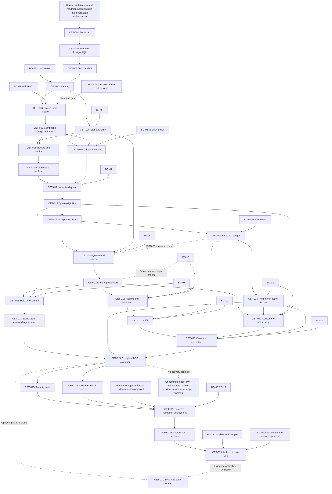

# Cetakin Cloud Implementation Roadmap

**Status: Human-approved at G0; BD-01 alignment on 2026-10-10.** This roadmap follows `AGENTS.md`, `README.md`, `VISION.md`, the reduced `PRD.md`, `DOMAIN.md`, `ARCHITECTURE.md`, `TEST_STRATEGY.md` and accepted ADR-001–007. CET-001–003 are completed; CET-004 has not started. BD-01 v1 is explicitly approved; BD-02–17 retain their gates. This documentation update does not execute a task or authorize deployment.

## 1. Principles, task types and approval gates

Deliver small business capabilities with server rules, persistence, customer/staff presentation and meaningful tests in the same task. Foundation tasks establish an executable environment rather than speculative entity frameworks. Security, denied authorization, truthful errors, safe redacted error/correlation logs, attribution and relevant transaction/storage evidence arrive with each capability; later hardening audits existing controls. Factual uncertainty/affected-action holds accompany the file, production, money and outcome behavior that first needs them; CET-023 integrates terminal correction rather than introducing all warnings late.

Task types are **FOUNDATION**, **PRODUCT**, **QUALITY/SECURITY**, **OPERATIONS**, and **PORTFOLIO**. Optional/post-MVP candidates are listed separately and are not delivery commitments. CET numbers are stable identities, not a requirement to execute a single numeric sequence. Dependencies determine execution. Each task is one reviewable outcome; if implementation reveals an oversized task, agree explicit sub-slices and acceptance criteria through a reviewed roadmap update before execution rather than merging an untested half-feature. CET-007 storage races and CET-018 retry/readiness are the highest scope-risk cards; no small-effort or calendar estimate is implied.

**G0 — Before any implementation:** human review/adoption of the roadmap and applicable architecture/ADRs, confirmation of React/TypeScript maintenance capability under ADR-002, and explicit implementation authorization. If that capability is absent, reconsider topology through an authorized ADR/document revision, not an accidental implementation substitution. Compatible supported versions are selected and locked during foundation work, not guessed here. G0 is a decision checkpoint, not a counted implementation task.

Business decisions must be adopted with attributable policy/version and dependent acceptance examples. BD-01 v1 is now adopted for customer entry, contacts, relationships and recovery policy; BD-05 still gates privileged recovery/staff authority. Other decisions remain unresolved. Synthetic demonstration is not operational permission. Real designs require BD-04/06 and verified recovery/fallback under BD-16; this schedule assumes synthetic data until the reliance gate. Proposed numerical pilot measures and a quiet demo never prove production readiness.

## 2. Task contract and shared definition of done

There are **30 implementation/delivery tasks**, CET-001–030; policy checkpoints and uncommitted future ideas are not included in that count. Expected areas below are conceptual ownership locations, not files created now or a prescribed complete directory tree. Each primary agent owns the whole vertical task, coordinating a specialist only with explicit disjoint file allocation. Code Reviewer reviews implemented changes; Reality Checker independently challenges critical milestone claims.

Test codes match `TEST_STRATEGY.md`: **U** domain/unit; **F** application/HTTP using PostgreSQL; **P** PostgreSQL constraints/migrations/independent-connection races; **S** real file adapters/failure boundaries; **C** frontend behavior; **E** focused browser journeys; **O** operational/manual validation. Require the lowest sufficient layers, not every code on every task. No SQLite certification of PostgreSQL behavior, fake policy defaults, arbitrary coverage target, or browser copy of every guard.

**Shared DoD:** adopted dependent policy; stated acceptance achieved; success/rejection/failure and appropriate current-access evidence pass; changed migrations tested on empty and representative existing PostgreSQL data; relevant user behavior verified; no unresolved BLOCKER/HIGH finding; documentation/instructions updated; commit/environment and actual evidence recorded. Failed, skipped, quarantined or unrun required checks block completion. Every card adds its own completion condition. A task passes after review and integration checks, not merely a developer declaration.

**Parallel labels:** PARALLEL-SAFE means genuinely disjoint work after prerequisites; CONDITIONALLY-PARALLEL requires an agreed stable contract and exclusive files; SEQUENTIAL means shared foundational/domain/integration ownership makes concurrent edits unsafe. No two agents edit the same file concurrently, even in worktrees. Orchestrator retains integration responsibility. Shared routes, migrations affecting the same invariant, dependency manifests, lockfiles, CI and shared layouts are reserved to one owner at a time.

## 3. Foundation milestone

### CET-001 — Bootstrap one application and boundary conventions [FOUNDATION]

- **Objective:** A minimal Laravel/PHP application serves one React/TypeScript Inertia page with SSR disabled.
- **Why now:** Later vertical slices need a working transport/build boundary, not a complete backend skeleton.
- **Scope:** Compatible locked dependencies; safe environment example/ignore rules; minimal named module ownership conventions; one neutral page and non-sensitive health response; dependency-free bootstrap configuration that does not require a database-backed session/read before CET-002; small accessible field/error conventions only when used. Approved production sessions arrive in CET-004.
- **Out of scope:** Product entities, customer registration/reset/email assumptions, generalized repositories, empty service hierarchies, API, SSR, Redis/workers.
- **Dependencies:** G0; no BD policy resolved by bootstrap.
- **Expected areas/files:** Application entry/configuration, dependency manifests/locks, route/page entry, minimal module notes and setup instructions.
- **Acceptance criteria:** Application/page and production asset build run; health reveals no private/environment values; a clean checkout reproduces supported dependencies; generated starter features outside approved scope removed.
- **Required test evidence:** O dependency-free page/health and clean-checkout startup smoke; build/type checks. This is a bootstrap check, not PostgreSQL-backed F or SQLite certification; real PostgreSQL F begins after CET-002/003.
- **Agent ownership:** Software Architect; Code Reviewer.
- **Parallelization:** SEQUENTIAL; owns shared bootstrap/manifests/routes/layout conventions.
- **Definition of Done:** Shared DoD plus recorded startup/build and reviewed module conventions; no business capability claim.

### CET-002 — Isolated Windows development and PostgreSQL [FOUNDATION]

- **Objective:** A Windows developer/worktree can run the application and isolated PostgreSQL reproducibly.
- **Why now:** Business persistence/tests must use the intended database before schema behavior is implemented.
- **Scope:** Purposeful Compose PHP/tooling/PostgreSQL configuration, Node build tooling, explicit test target and private local file root; safe PowerShell/WSL instructions; unique project/ports/volumes per worktree.
- **Out of scope:** Production hosting, object emulator before adapter tests need it, Redis, queues, Kubernetes; installing host tools without authorization.
- **Dependencies:** CET-001; confirmed Docker/WSL availability or reviewed equivalent PostgreSQL environment.
- **Expected areas/files:** Development container/Compose/config examples, database environment and setup/reset instructions.
- **Acceptance criteria:** Empty database migrations run; test reset cannot target production/another worktree; two checkouts use distinct resources; secrets/uploads/dependencies stay untracked.
- **Required test evidence:** P connection/empty-migration smoke; O clean setup and two-worktree isolation/reset checks.
- **Agent ownership:** DevOps Automator; Backend Architect and Code Reviewer.
- **Parallelization:** SEQUENTIAL; application/runtime configuration contract changes before downstream tasks.
- **Definition of Done:** Shared DoD plus documented commands/resource ownership and successful PostgreSQL startup/test isolation.

### CET-003 — Minimal test harness and PR quality gate [FOUNDATION]

- **Objective:** The actual application can be checked consistently locally and in CI.
- **Why now:** First features must add evidence to a working gate, not defer tests to hardening.
- **Scope:** Framework tests with PostgreSQL, deterministic synthetic actor/data builders as needed, focused component runner, formatter/static/type checks, asset build and locked dependency install; initial GitHub Actions checks if hosted on GitHub; restricted tokens/no PR deployment secrets.
- **Out of scope:** Deployment workflows, empty-test success claims, coverage percentage, large browser matrix, path-based skipping before trustworthy selection.
- **Dependencies:** CET-002; GitHub hosting confirmed for GitHub-specific configuration.
- **Expected areas/files:** Test configuration/minimal smoke cases, lint/type tools, CI quality workflow and contributor instructions.
- **Acceptance criteria:** Known failing check fails gate; initial smoke/type/build checks pass; normal F uses PostgreSQL; independent-connection P and storage test resources can be isolated. Add required groups as capabilities appear; main checks its actual merged commit.
- **Required test evidence:** F/P harness smoke; C one used page behavior; O local/CI gate demonstration and intentional failure.
- **Agent ownership:** DevOps Automator; Code Reviewer, Backend Architect and Frontend Developer.
- **Parallelization:** SEQUENTIAL; reserves CI/manifests/locks/test configuration, then stabilizes downstream contracts.
- **Definition of Done:** Shared DoD plus green actual baseline and demonstrated fail-closed gate; no application readiness claim.

## 4. Identity and authorization milestone

### CET-004 — Approved actor identity and owned customer session [PRODUCT]

- **Objective:** A customer self-registers/logs in with email/password and accesses only their current related customer records.
- **Why now:** Intake needs established ownership and attributable future decisions.
- **Scope:** BD-01 v1 email/password self-registration; first registration creates one User, one Customer contact/profile and one relationship without permanent one-to-one cardinality. Name/Email/WhatsApp-or-phone contact; supported password hashing, login throttling, database sessions, session rotation/expiry/revocation/logout, CSRF/cookie controls, scoped reads and safe projections.
- **Out of scope:** Verification email/email infrastructure, self-service password reset, JWT/OAuth/SSO, staff roles/generalized RBAC, multi-customer management UI and privileged manual recovery action (CET-005 after BD-05).
- **Dependencies:** CET-003; BD-01 v1 adopted on 2026-10-10. BD-05 is not required for customer-only entry. This policy record does not start CET-004.
- **Expected areas/files:** Access identity/policies/migrations/actions, session configuration, entry/own-record pages and tests.
- **Acceptance criteria:** Registration creates the initial User/Customer/relationship consistently with no staff role or verification-email requirement; valid/invalid login and throttling behave truthfully. Passwords are hashed, authentication rotates session, A sees only related records, B IDs/list entries and forged ownership/staff fields are denied. Logout/expiry/revocation deny later access; contact/email matching alone grants none. Model can represent non-one-to-one relationships without new management features; sensitive responses do not leak props/cache private data.
- **Required test evidence:** F/P registration consistency/ownership/cardinality/session guards and password/login rejection; C registration/login/expiry/errors; focused production-equivalent CSRF/session security smoke per TEST_STRATEGY section 4.1, O approved BD-01 v1 examples.
- **Agent ownership:** Backend Architect; Code Reviewer and Frontend Developer.
- **Parallelization:** SEQUENTIAL; central identity/policy/session contract must settle before feature use.
- **Definition of Done:** Shared DoD plus customer-entry portion of BD-01 v1 and passing Customer A/B isolation/security smoke. Administrative assisted recovery remains an explicit CET-005 deliverable after BD-05; CET-004 completion must not claim the full recovery workflow exists. This avoids a CET-004↔CET-005 dependency cycle.

### CET-005 — Fixed staff responsibilities and revocation [PRODUCT]

- **Objective:** Task-authorized administrators/operators receive only their approved responsibilities, and later access stops after revocation.
- **Why now:** First staff review must never inherit blanket privileges.
- **Scope:** Small attributable grant/revoke path, task access and assignment checks, current-permission queries, shared scoped projections; no production-only money/design-directory privilege. Add BD-01 v1's owner/admin manual assisted recovery after external verification with attributable access changes, using approved BD-05 authority.
- **Out of scope:** Configurable role/permission editor, delegation product, departments, cached long-lived permission grants.
- **Dependencies:** CET-004; BD-05 adopted before staff access.
- **Expected areas/files:** Access grants/policies/history/actions and minimal owner workflow/tests.
- **Acceptance criteria:** Approved staff grants/current checks and existing Access read/grant surface allow or deny correctly; no self-promotion; revocation immediately changes the current grant decision and denies later existing Access actions; actor/time/reason retained; admin-as-customer still requires own verified relationship. Actual file/update endpoints are not present yet: CET-006/007 add customer revoked-download checks and staff checks if both capabilities exist; whichever capability arrives second adds real staff grant/file integration. CET-008 owns the final staff-file/revocation acceptance before first staff use, regardless branch order; CET-015 adds revoked production-update checks before that feature completes.
- **Recovery acceptance criteria (BD-01 v1):** Only an approved owner/admin can apply an externally verified assisted-recovery change; customer/operator/unapproved staff attempts fail. Resulting access is truthful, the responsible actor/time/reason is retained, and existing agreement attribution remains unchanged. No reset email or staff impersonation is introduced.
- **Required test evidence:** F/P existing Access allowed/denied checks, grant history and manual recovery authorization/attribution with preserved historical decisions; C revoked Access-page/recovery response where implemented; O owner authority and external-recovery-process validation. Do not certify missing file/production routes with a fake endpoint.
- **Agent ownership:** Backend Architect; Code Reviewer.
- **Parallelization:** CONDITIONALLY-PARALLEL with CET-006 only after CET-004 contracts stabilize; owns staff-grant files exclusively, no shared policy/route/schema edits without serial integration.
- **Definition of Done:** Shared DoD plus approved staff matrix/revocation and BD-01 v1 assisted-recovery evidence, ready before CET-008 staff review. No email reset or identity-verification product is added.

## 5. Customer intake milestone — first useful vertical slice

### CET-006 — Owned valid request with private STL/3MF and confirmation [PRODUCT]

- **Objective:** Customer submits approved specification/files and receives one owned request/exact version plus truthful status.
- **Why now:** This is the first substantial user-visible business feature, with neither quotations nor staff workflow.
- **Scope:** Material/color/options/whole quantity; bounded STL/3MF checks including safe archive/XML handling; durable scoped upload intent before private local write, non-overwrite bytes, exact Design File Version/provenance, short committed association/result; same-attempt retry; authorized attachment read; progress/error/unknown-result UI, proportional upload/download limits and safe denial history.
- **Out of scope:** Saved drafts, previews/slicing/geometry/malware claims, automated pricing, broad cleanup, quotations.
- **Dependencies:** CET-004; BD-01/02/03 adopted; BD-04/06 before real designs. This schedule uses synthetic files until reliance gates.
- **Expected areas/files:** Intake actions/migrations/pages, File Handling upload/version/read capability, own-status projection, synthetic fixtures and tests.
- **Acceptance criteria:** Valid STL and 3MF produce one owned confirmed request/exact bytes; invalid/oversize/incomplete input gives no false success; changed payload under same operation conflicts; deliberate new attempt allowed; A cannot read B metadata/bytes; revoked access denied. SQL/object failures preserve earlier confirmed work. Intent claim guards protect uncertain/associated content.
- **Required test evidence:** U quantity; F/P submission/retry/rollback and simultaneous same attempt; S local write-once/format/security/access; C progress versus confirmation/errors/unknown results.
- **Agent ownership:** Backend Architect; Frontend Developer as disjoint presentation contributor, Code Reviewer.
- **Parallelization:** CONDITIONALLY-PARALLEL with CET-005 under Access contract; within this task allocate Intake/File actions to backend and stable page/component files to frontend, one route/migration integrator.
- **Definition of Done:** Shared DoD plus demonstrable local private intake and failure preservation; not an object-storage or real-reliance certification.

### CET-007 — Exact object adapter and bounded intent reconciliation [PRODUCT/QUALITY]

- **Objective:** The intake slice works through the compatible private object adapter without overwrite/cleanup races.
- **Why now:** Prove the architecture's separate object/SQL boundary before object-backed use; add an isolated compatible environment only now.
- **Scope:** Narrow provider-compatible write-once/exact immutable-version capability, size/digest verification, same intent completion/retry, controlled reconciliation/unused cleanup claims; optional isolated object test service, private reads and actual deletion confirmation.
- **Out of scope:** Production provider selection, workers/Redis, age-only orphan sweeps, ETag-as-digest, automatic retention.
- **Dependencies:** CET-006; BD-03, approved operational intent disposition under BD-06 before actual deletion; synthetic adapter evidence may precede real-retention policy.
- **Expected areas/files:** File adapter/intent maintenance capability and S/P tests; isolated compatible storage environment owned by DevOps.
- **Acceptance criteria:** Concurrent same-attempt writes cannot substitute bytes; completion/cleanup race yields protected association or claimed-unused deletion, never success pointing to deleted content. Object-success/SQL-failure and SQL-intent/object-failure recover same attempt truthfully; public/anonymous read denied; uncertainty protected.
- **Required test evidence:** S actual compatible adapter/private access/write semantics; P intent claim races and commit failure; F/C recoverable unknown result. Emulator does not certify an unverified production provider.
- **Agent ownership:** Backend Architect; DevOps Automator and Code Reviewer.
- **Parallelization:** SEQUENTIAL after CET-006 file contract; reserves File Handling/adapter/intent schema and storage config.
- **Definition of Done:** Shared DoD plus repeatable compatible-adapter evidence. CET-001/002/003/004/006/007 constitute the synthetic first usable intake checkpoint.

## 6. Staff review and clarification milestone

### CET-008 — Review/decline and responsible work list [PRODUCT]

- **Objective:** Administrator reviews intake or declines unsuitable work with a clear next action.
- **Why now:** Submitted requests need a usable business response before pricing.
- **Scope:** Authorized work list, completeness/suitability/manual material-color availability findings, review sufficiency, responsible staff/next action including waiting work, customer-visible decline reason and retained facts.
- **Out of scope:** Inventory/catalog, file analysis/checklist engine, notifications/escalation, general CRM.
- **Dependencies:** CET-005 and CET-007; BD-02/05 adopted; BD-04 only before real design use, not synthetic review; BD-13 minimum factual-error warning/hold procedure before operational use.
- **Expected areas/files:** Intake review/list/disposition actions/pages/history and own-request presentation/tests.
- **Acceptance criteria:** Insufficient review remains visible and cannot later quote; authorized decline retains history/reason and is terminal; operators/unassigned staff cannot review protected work; open missing/stale actions identifiable; sole-owner responsibility works. Actual staff file metadata/read/download is task-authorized, and revocation after a staff page opens denies subsequent real reads/downloads. Whichever grant/file capability arrives second adds the integration test, with CET-008 verifying it no later than first staff-file use regardless CET-005/006/007 branch order.
- **Required test evidence:** F state/permission/history and actual staff-file scope/revocation requests; S authorized versus task-revoked download against real adapter; C list/review/errors/public reason and already-open revoked page; O actual review examples. Existing Access grant tests alone are insufficient.
- **Agent ownership:** Backend Architect; Frontend Developer and Code Reviewer.
- **Parallelization:** SEQUENTIAL; shared Intake state/list contract.
- **Definition of Done:** Shared DoD plus reviewed request and declined request demonstrated without quoted/order side effects; real staff-file/revocation integration passes before first staff-file use, including when intake finished before staff grants.

### CET-009 — Clarification reply and reviewed file replacement [PRODUCT]

- **Objective:** Customer answers an attributable clarification; staff re-review exact replacement inputs.
- **Why now:** Unsuitable/incomplete work must be corrected before quotation.
- **Scope:** Linked question/reply/actor/time, own customer response, new exact file/specification version, administrator sufficiency review and waiting action; later quotation invalidation hooks added with CET-012.
- **Out of scope:** Chat/general messaging, notifications, silent replacement, order amendments.
- **Dependencies:** CET-008; BD-02/03/05 adopted for specification/handling/staff behavior; BD-04/06 before real designs/retention, BD-06 before actual policy-dependent deletion, not synthetic clarification development.
- **Expected areas/files:** Intake clarification/re-review and File replacement actions, customer/staff forms and tests.
- **Acceptance criteria:** Reply does not self-approve review; silence creates no agreement/cancellation; replacement keeps old version evidence, unauthorized replacement denied; failed new upload leaves existing files/request/history intact.
- **Required test evidence:** F/P version provenance/state guards; S replacement failure/exact bytes; C question/reply/errors; O clarification walkthrough.
- **Agent ownership:** Frontend Developer coordinating backend action owner; Code Reviewer.
- **Parallelization:** SEQUENTIAL; Intake replacement/review contracts overlap prior task and file-version writes.
- **Definition of Done:** Shared DoD plus identifiable reply/replacement/re-review journey with preserved originals.

### CET-010 — Assisted deletion and unavailable-file truth [PRODUCT]

- **Objective:** Owner handles permitted deletion while preserved references remain truthful and dependent work cannot use missing designs.
- **Why now:** Real file handling needs an actual adopted process, not an indefinite retention promise.
- **Scope:** Customer deletion request, owner approved/deferral outcome, evidence/availability marker, blocked dependent work, confirmed private-byte removal and failed removal tracking; permitted recovery-copy disposition instructions.
- **Out of scope:** Self-service erasure, automatic retention, cross-customer deduplication, erasing important agreement/history.
- **Dependencies:** CET-007 and CET-005; BD-06 adopted for deletion behavior, BD-05 staff authority; BD-04 before real design use. Downstream quote/job/fulfill guard integration required when those tasks arrive.
- **Expected areas/files:** File deletion/availability actions, minimal request/owner presentation, retained provenance/history and tests/runbook.
- **Acceptance criteria:** Denied deletion changes no business data; failure is pending/unavailable, not completed removal; permitted exact references remain; absent content gives warning and blocks dependent actions as implemented; restore must honor deletion policy.
- **Required test evidence:** S removal failure/private reads; F/P claim/provenance/current permissions; C request/result; O approved assisted process/recovery-copy handling.
- **Agent ownership:** Backend Architect; Code Reviewer.
- **Parallelization:** CONDITIONALLY-PARALLEL with CET-008/009 only on stable File availability/read contract and exclusive deletion files; same metadata migrations/routes/history helpers serially integrated.
- **Definition of Done:** Shared DoD plus owner-approved retention/deletion procedure and evidence; not automated erasure certification.

## 7. Quotation and exactly-one-order milestone

### CET-011 — Draft and issue fixed quotation [PRODUCT]

- **Objective:** Reviewed request yields an identifiable customer-visible immutable issued quote.
- **Why now:** Exact agreement must precede production commitment.
- **Scope:** Manual draft/issue, exact reviewed specification/files/quantity/total/currency/terms, deadline only if offered, one current proposal, draft versus fixed-issued persistence defenses and history.
- **Out of scope:** Pricing engine/tax suite, acceptance, order creation, post-start changes.
- **Dependencies:** CET-009 and CET-010; BD-07 adopted; BD-05 authority and BD-03/06 availability.
- **Expected areas/files:** Intake quotation actions/migrations/values, staff draft and own-customer view/tests.
- **Acceptance criteria:** Insufficient review/missing file blocks issue; issued payload cannot be edited even by alternate write path; exact version/time/terms visible to owner/customer, no prices in operator props; no invented expiry duration.
- **Required test evidence:** U approved Money/Quantity rules; F/P review/current-version/immutability; C form/exact quote view; O terms examples.
- **Agent ownership:** Backend Architect; Frontend Developer and Code Reviewer.
- **Parallelization:** SEQUENTIAL; quote/state/schema ownership.
- **Definition of Done:** Shared DoD plus fixed issued quote retrievable with exact owned references and no acceptance side effect.

### CET-012 — Supersede, withdraw, reject and honor deadlines [PRODUCT]

- **Objective:** Only the current eligible proposal can be decided; old proposals remain inspectable.
- **Why now:** Acceptance must not ship against stale/ineligible versions.
- **Scope:** New unaccepted replacement version/supersession, authorized withdrawal, own rejection with next action, stated deadline eligibility at action time, re-review invalidates pending proposal; truthful stale/conflict UI.
- **Out of scope:** Expiry scheduler, silence disposition, multiple competing proposals, accepted-order amendments.
- **Dependencies:** CET-011; BD-07 and current ownership/authority decisions.
- **Expected areas/files:** Intake quote eligibility/decision actions/history, replacement/rejection views and tests.
- **Acceptance criteria:** Stale/rejected/withdrawn/expired version cannot accept; rejected quote creates no order; terminal versions not reactivated; exactly one current proposal; re-review replacement retains originals; refreshing conflict does not auto-decide new version.
- **Required test evidence:** F/P unique-current/guards; frozen-clock before/at/after deadline; C conflict/rejection; O rejected/replaced quotation.
- **Agent ownership:** Backend Architect; Code Reviewer and Frontend Developer.
- **Parallelization:** SEQUENTIAL; same quotation/version contract as CET-011/013.
- **Definition of Done:** Shared DoD plus current-version/deadline/rejection evidence ready for acceptance integration.

### CET-013 — Accept exact quotation and create one traceable order [PRODUCT]

- **Objective:** Own eligible customer acceptance commits one agreement and one retrievable order.
- **Why now:** Connects intake to operations with the highest-value consistency guarantee.
- **Scope:** Common Request lock; recheck ownership/current eligibility/available exact files; immutable acceptance evidence, converted request, one Order/initial payable basis/result/history in one transaction; retry/ambiguous-response lookup and safe customer order page.
- **Out of scope:** Separate asynchronous conversion/API, production release, arbitrary paid toggle, pre-start amendment.
- **Dependencies:** CET-012; BD-01/05/07 adopted; BD-14 remains a payment-behavior gate, no event arithmetic assumed here.
- **Expected areas/files:** Named acceptance coordinator, Intake/Operations owned actions/migrations, exact order projection, decision/confirmation UI and tests.
- **Acceptance criteria:** Two accepts return same order; accept versus supersede/withdraw/deadline cannot accept stale basis; failure rolls back new agreement/order/history while earlier data survives; lost response resolves committed same order; no successful orphan conversion, no staff impersonation.
- **Required test evidence:** F/P constraints, rollback, independent-connection races/retry; S missing-file guard; C exact-version decision/unknown outcome; E2E-01 introduced now.
- **Agent ownership:** Backend Architect; Code Reviewer and Reality Checker milestone review.
- **Parallelization:** SEQUENTIAL; reserves Request/Order coordinator, shared provenance schema and route integration.
- **Definition of Done:** Shared DoD plus passing E2E-01 and initial agreement/order invariant review; queued order does not imply release.

## 8. Pre-production amendment milestone

These tasks execute **after CET-014/015 introduce real job/start guards**. This avoids a fictitious no-job-ever-started check. Scheduling can postpone the branch while normal flow is built; both tasks remain required for the approved complete MVP. Removing them requires explicit scope revision. Never deploy changed work merely from a note.

### CET-016 — Issue one held never-started amendment [PRODUCT]

- **Objective:** Owner proposes changed scope/price only for queued never-started work and puts it on hold.
- **Why now:** Existing normal order/start model makes the reduced boundary enforceable.
- **Scope:** One current proposal tied to current accepted basis, exact replacement files/scope/terms; shared Request then Order locking; immutable issue and blocking hold; late-change visible exception/responsible action with frozen original.
- **Out of scope:** Live/post-start amendment engine, partial continuation, competing chains, forced cancellation/replacement policy.
- **Dependencies:** CET-015, CET-012; BD-08 adopted, BD-07 terms, BD-09 release and file policy.
- **Expected areas/files:** Intake amendment issue and Operations hold/coordinator, staff/customer proposal presentation and tests.
- **Acceptance criteria:** Historical actual start remains disqualifying after failed/cancelled job; issue versus start has only guarded winner outcomes; issued hold denies start; late proposal leaves exact original basis/price unchanged and cannot authorize surcharge.
- **Required test evidence:** F/P independent-connection issue/start race and history/current-basis guards; S exact files; C hold/proposal warning; O owner boundary acceptance.
- **Agent ownership:** Backend Architect; Code Reviewer and Reality Checker.
- **Parallelization:** SEQUENTIAL; shares Order/start lock and Intake proposal writes, cannot overlap production/payment mutation integration.
- **Definition of Done:** Shared DoD plus proven common-lock/hold behavior; proposal alone changes no accepted order.

### CET-017 — Renew agreement on the same order [PRODUCT]

- **Objective:** Own eligible renewed agreement updates the same order/current payable without releasing obsolete work.
- **Why now:** Completes the reduced amendment branch after safe issue/hold exists.
- **Scope:** Accept/reject/retry with retained original agreements; same Order basis/payable update atomically; obsolete queued jobs held/cancelled/recreated before approved release; rejection/silence keeps original agreement, owner action resolves hold under adopted policy.
- **Out of scope:** New order per amendment, price override, scope/output reuse engine, arbitrary hold release.
- **Dependencies:** CET-016; BD-08/07/09 adopted. If CET-019/020 exist, integrate their current-basis/event contracts and run real cross-capability tests before merge. If money features arrive later, CET-019/020 become responsible for that integration/evidence; do not invent a receipt action fixture or add a blanket payment dependency.
- **Expected areas/files:** Acceptance coordinator and Intake/Operations/Payments basis capability, customer decision/owner release presentation/tests.
- **Acceptance criteria:** No duplicate order/agreement on retry; stale basis/historical start denies; racing job start remains denied under issued hold even if acceptance fails; accepted old jobs never start; projections never mix new scope/old payable; prior agreement/payment evidence preserved.
- **Required test evidence:** F/P acceptance/start and coherent accepted/payable-basis tests with separate connections; amendment-versus-real-payment/event races only once both capabilities exist, required in whichever branch introduces the second capability; C stale/reject/unknown result; O renewed agreement walkthrough. CET-024 verifies complete integrated evidence.
- **Agent ownership:** Backend Architect; Code Reviewer and Reality Checker.
- **Parallelization:** SEQUENTIAL; shared agreement/Order/payable transaction boundary.
- **Definition of Done:** Shared DoD plus demonstrable same-order amendment and corrected-job release; existing money event regressions pass when present. Record later cross-capability evidence owner as CET-019/020 if those features are absent.

## 9. Production milestone

### CET-014 — Manual production queue, exact jobs and approved release [PRODUCT]

- **Objective:** Owner sees agreed work and creates/assigns exact queued jobs with explicit release eligibility.
- **Why now:** Accepted orders need operational preparation before actual printing.
- **Scope:** Authorized manual queue, exact accepted basis/files/quantity, responsible action/assignment; owner-only job creation; approved BD-09 release checks separate from payment label and acceptance; terminal/hold/file guards, attributable queued job cancellation.
- **Out of scope:** Printer integration, automatic scheduling, operator job creation, inventory or mandatory prepayment assumption.
- **Dependencies:** CET-013 and CET-005; BD-09 adopted, BD-02/05. **If approved release depends on verified receipts, CET-019 is an additional prerequisite for release-enabled behavior.** Until then keep release blocked, not a fake paid override.
- **Expected areas/files:** Operations queue/job/release actions/migrations, operator-safe projections/pages, payment read capability when needed and tests.
- **Acceptance criteria:** Operator sees only authorized work/no prices; exact job provenance enforced; held/missing/terminal work blocked; no actual start manufactured by assignment/release; release follows adopted examples with correct unpaid/partial/paid truth.
- **Required test evidence:** F/P provenance/authority/queued guards; C queue/detail/release errors; O policy release examples.
- **Agent ownership:** Backend Architect; Frontend Developer and Code Reviewer.
- **Parallelization:** CONDITIONALLY-PARALLEL with CET-019 only when release does not require its unfinished behavior and Order/basis read contracts/shared files are reserved; otherwise sequential.
- **Definition of Done:** Shared DoD plus exact assigned queued work and truthful approved release; no printer automation.

### CET-015 — Actual progress, failure, holds and own tracking [PRODUCT]

- **Objective:** Authorized staff record actual printing facts, and customers see truthful safe progress.
- **Why now:** Establishes the production-start invariant before amendment and retry behavior.
- **Scope:** Common Order lock; start/release/current permission/files/hold checks; retained first start, progress/interruption/output/failure/actual-stop terminal facts; delay/reason/next action; customer-safe status and invalid transition guards.
- **Out of scope:** Separate paused state, reset terminal attempts, automatic readiness, printer telemetry, manufactured stop.
- **Dependencies:** CET-014 (and conditional CET-019); BD-09/05 adopted; BD-10 needed for usable-output/verification rules, not to preserve factual failure independently.
- **Expected areas/files:** Operations start/result/hold/status actions, customer/operator views and focused tests.
- **Acceptance criteria:** Unauthorized/revoked/stale/held job denies unchanged; actual start/history survives failure/cancellation; failed units not usable; public status distinguishes delay/interruption/unknown result; operator cannot grant admin/financial privilege or close order.
- **Required test evidence:** U effective public status; F/P transition/lock/history/provenance; S availability guard; C progress/delay/errors; O operator walkthrough.
- **Agent ownership:** Backend Architect; Frontend Developer and Code Reviewer.
- **Parallelization:** SEQUENTIAL; shared Order/job state/lock establishes downstream contracts.
- **Definition of Done:** Shared DoD plus actual-start/failure and safe tracking demonstrated; no ready/fulfilled claim yet.

## 10. Failure, reprint and readiness milestone

### CET-018 — Approved linked retry and verified truthful readiness [PRODUCT]

- **Objective:** Failed/defective work receives an approved new same-scope attempt; only verified output becomes ready.
- **Why now:** Completes real production exceptions without hiding failure or changing price.
- **Scope:** Operator retry proposal, owner approval/new linked job; usable quantity/checks/all jobs terminal, cancel unnecessary queued work; defect immediately withdraws public readiness and holds fulfillment; approved same-scope ready rework changes stage at actual start.
- **Out of scope:** Automatic surcharge, operator retry creation/delegation, salvage/allocation, changed-scope retry, terminal restart.
- **Dependencies:** CET-015; BD-10 approved, BD-08 late-change/surcharge handling, BD-09 release. CET-016/017 need not be built first, but remain MVP mandatory.
- **Expected areas/files:** Operations retry/readiness/defect actions/history, owner/operator/customer views/tests.
- **Acceptance criteria:** Failed attempt/history retained; new job links same order/prior attempt/basis; failed units excluded; incomplete output/nonterminal jobs denies readiness; known ready defect immediately appears not-ready; rework preserves original success fact and price; late surcharge held.
- **Required test evidence:** U status/output; F/P lineage/guards/readiness and terminal history; C defect/retry visibility; O failed/reprint/quality walkthrough. Extend E2E-02 after fulfillment CET-021.
- **Agent ownership:** Backend Architect; Code Reviewer and Frontend Developer.
- **Parallelization:** SEQUENTIAL against CET-016/017, shared Order/job/hold coordination; schedule branch order explicitly.
- **Definition of Done:** Shared DoD plus failure→approved new attempt→verified readiness, with immediate known-defect withdrawal.

## 11. External payment milestone

### CET-019 — Verified receipt and truthful derived summary [PRODUCT]

- **Objective:** Owner records external receipts once; customer sees own unpaid/partial/paid or unresolved balance separately from physical work.
- **Why now:** Can begin after order creation and must advance before release if BD-09 requires it.
- **Scope:** Retained Payment Event/provenance/evidence, approved exact currency/precision/arithmetic; scoped operation identity; derived current-basis summary including zero/no-payment-due, excess/unknown/mismatched currency; customer-safe fields and restricted operator access.
- **Out of scope:** Gateway, invoicing/accounting, currency conversion, manual paid toggle, duplicate-by-amount detector.
- **Dependencies:** CET-013; BD-07/09/14 adopted. If CET-017 exists, integrate its basis contract and run amendment/payment race and coherent-snapshot evidence before merge; if amendments arrive later, CET-017 owns that integration. No fabricated amendment/receipt action replaces missing capability.
- **Expected areas/files:** Payments receipt/summary values/actions/migrations, staff form/customer summary, Order release read contract and tests.
- **Acceptance criteria:** No receipts/partial/exact/excess/unknown examples match approved rules; retry creates one event, equal legitimate distinct payments allowed; changed retry payload conflicts; response loss resolves existing event; customer/operator cannot verify receipt; recording changes no physical stage.
- **Required test evidence:** U arithmetic; F/P concurrent receipt/retry/rollback/provenance/coherent basis, plus real amendment/payment races when CET-017 exists; C confirmation/unknown/disclosure; O owner money examples.
- **Agent ownership:** Backend Architect; Code Reviewer and Frontend Developer.
- **Parallelization:** CONDITIONALLY-PARALLEL with CET-014 only under fixed disjoint payment versus queue files and agreed Order read contract; no concurrent shared coordinator/schema edits; conditional release dependency controls merge.
- **Definition of Done:** Shared DoD plus retained receipts/current-basis summary and policy-valid release integration if needed; second-capability amendment/payment evidence completed before merge when applicable, with any later integration owner recorded.

### CET-020 — Refund, linked correction and dispute evidence [PRODUCT]

- **Objective:** Owner records approved external financial corrections without rewriting original money truth.
- **Why now:** Completes financial exceptions before cancellation/closure decisions depend on them.
- **Scope:** Verified external refund/approved correction linked to original event/reason/actor/time; retained original customer/order provenance; explicit discrepancy/known-or-unknown amount/owner/action/resolution; updated derived summary and revocation guards.
- **Out of scope:** Executing refund, quote-price override/write-off automation, destructive reassignment, reconciliation/case-management platform.
- **Dependencies:** CET-019; BD-14 and minimum BD-12 refund treatment adopted; BD-07/09 remain relevant. If CET-017 exists, integrate/test corrective events against its current-basis contract before merge; otherwise CET-017 owns that later cross-capability integration.
- **Expected areas/files:** Payments corrective events/dispute actions/views/tests; coherent Order current-basis read integration.
- **Acceptance criteria:** Approved refund/correction arithmetic follows examples; invalid/unapproved mutation denied with originals intact; dispute remains explicit even numerically paid; retry once; terminal physical work remains terminal after money event; amendment/closure reads cannot use stale mixed basis.
- **Required test evidence:** U/F/P correction/provenance/event retry and real payment-versus-amendment when CET-017 exists, required before second-capability merge; C discrepancy/evidence/summary; O refund/correction approval examples.
- **Agent ownership:** Backend Architect; Code Reviewer.
- **Parallelization:** SEQUENTIAL after CET-019; no simultaneous amendment/payable coordinator edits.
- **Definition of Done:** Shared DoD plus correction/dispute history and approved monetary examples; relevant existing amendment regressions pass, or CET-017 recorded as later integration owner; no gateway claim.

## 12. Fulfillment, cancellation and closure milestone

### CET-021 — Record verified fulfillment [PRODUCT]

- **Objective:** Owner records actual offered handoff with independent truthful money state.
- **Why now:** Verified ready output can now reach a physical customer outcome.
- **Scope:** Offered method/time/evidence, ready/usable/terminal-job/no-error/file guards, attributable outcome and public view; complete E2E-02 using prepared accepted/released fixture.
- **Out of scope:** Shipping integration, auto-settlement, closing, active-job fulfillment.
- **Dependencies:** CET-018 and CET-019; BD-11 adopted, BD-10 checks; relevant BD-06 availability. Refund/cancellation rules do not imply fulfillment entitlement.
- **Expected areas/files:** Operations fulfillment action/page/projection/history and tests/browser flow.
- **Acceptance criteria:** Verified ready handoff permitted; defect/nonterminal job/unavailable basis denied; fulfilled unpaid work stays unpaid according to approved independent facts; operator/customer cannot fulfill; actual evidence retained.
- **Required test evidence:** F/P readiness/outcome/financial independence; C guarded confirmation/status; E2E-02; O offered handoff validation.
- **Agent ownership:** Backend Architect; Frontend Developer, Code Reviewer.
- **Parallelization:** SEQUENTIAL; Order/outcome guards shared with cancellation/closure.
- **Definition of Done:** Shared DoD plus passing E2E-02 and adopted handoff evidence; fulfilled does not imply closed.

### CET-022 — Cancellation request, decision and confirmed stopped outcome [PRODUCT]

- **Objective:** Customer/staff requests cancellation; owner records approved/declined outcome without pretending work stopped or money settled.
- **Why now:** Queued/started work now has factual stop and payment paths to reconcile.
- **Scope:** Own request versus owner decision, unaccepted request cancellation with pending quote invalidation, queued-job cancellation, actual active-stop confirmation, guarded final Order cancellation and produced-output/residual-money evidence.
- **Out of scope:** Automatic free refund/charges, tariff engine, cancelling from request alone, terminal reopening.
- **Dependencies:** CET-015, CET-020 and CET-012; BD-12 adopted, BD-09/14 monetary/release truth.
- **Expected areas/files:** Intake/Operations cancellation coordinator/actions/views, payment-summary reads and tests.
- **Acceptance criteria:** Request/decline retains actual work state; final cancellation requires terminal/stopped work, prevents queued starts, preserves physical output/balance; cancel-versus-start contention cannot fabricate stop; requester/operator cannot approve; terminal request/order stays terminal.
- **Required test evidence:** F/P cancellation/start race and provenance/history; C request/decision/stop uncertainty; O queued/active cancellation examples.
- **Agent ownership:** Backend Architect; Code Reviewer and Frontend Developer.
- **Parallelization:** SEQUENTIAL; shared Request/Order/jobs and outcome locks, reserve cross-module coordinator.
- **Definition of Done:** Shared DoD plus queued and active-stop cases with truthful money/no startable residual work.

### CET-023 — Accurate closure and supported factual correction [PRODUCT]

- **Objective:** Owner closes accurate fulfilled/cancelled work and preserves warning/correction evidence for affected errors.
- **Why now:** All physical/financial terminal evidence needed for adopted closure rules exists.
- **Scope:** Adopted payment/residual-responsibility rule, terminal-job/error checks; factual-warning/affected hold/owner/action, preserved original and manual approved resolution evidence; later money events without physical reopening.
- **Out of scope:** Generic terminal reopening, arbitrary agreement/event edits, closing disputed/error work by hiding it, blocking unrelated accurate work.
- **Dependencies:** CET-021, CET-022 and CET-020; BD-13 adopted; BD-12/14 residual treatment.
- **Expected areas/files:** Operations close/correction coordinator and public safe status, Payments coherent summary reads, tests/instructions.
- **Acceptance criteria:** Accurate adopted outcome closes with explicit residual money responsibility; affected error denies closure and appears unverified to customer/staff; correction retains original/time/reason; note alone grants no transition; close-versus-payment race cannot conceal discrepancy; unrelated valid closure allowed.
- **Required test evidence:** F/P closure/payment/current-basis and invalid transition tests; C uncertainty/correction; O close/error/manual-safe-action examples.
- **Agent ownership:** Backend Architect; Code Reviewer and Reality Checker.
- **Parallelization:** SEQUENTIAL; final Order/payment history and terminal guard contract.
- **Definition of Done:** Shared DoD plus retained physical/payment/error truth and adopted supported manual resolution.

## 13. Integrated validation and production hardening milestone

### CET-024 — Validate complete synthetic MVP and owner workflow fit [QUALITY/SECURITY]

- **Objective:** Integrated capability evidence accounts for all active MUST behavior and the two selected browser journeys.
- **Why now:** Individual task success does not prove the merged end-to-end product.
- **Scope:** Trace actual tests to strategy capability groups, run merged U/F/P/S/C plus E2E-01/02/security smoke; owner/operator normal/clarification/rejection/amendment/failure/reprint/payment/cancel/fulfill/close walkthroughs; coherent error/failure/unknown outcome review.
- **Out of scope:** Late first-time feature tests, exhaustive browser matrix, invented benefit metrics, production-readiness certification.
- **Dependencies:** CET-010, CET-017, CET-018, CET-020 and CET-023 (therefore all product prerequisites); applicable feature-policy BD-01–14 adopted for the implemented behavior. Real-design-only BD-04/06 obligations are additionally required before real use; synthetic examples do not silently approve them. CET-010 still requires adopted deletion rules.
- **Expected areas/files:** Existing behavior tests and only justified regression additions, staff acceptance instructions/evidence.
- **Acceptance criteria:** Every active MUST has evidence owner; both browser flows pass on integrated commit; specified SQL/object failure/retry/revocation scenarios preserve truth; owner approves actual workflow fit or findings remain blockers.
- **Required test evidence:** U/F/P/S/C/E relevant integrated suite; O strategy section 14 checklist. No extra full browser journey without observed need.
- **Agent ownership:** Software Architect as integration owner; Code Reviewer and independent Reality Checker; PM coordinates owner validation.
- **Parallelization:** SEQUENTIAL integrated checkpoint; freeze shared feature changes while certifying the candidate.
- **Definition of Done:** Shared DoD plus traceable actual integrated evidence and manual acceptance; remaining operational gates named.

### CET-025 — Focused security and authorization audit [QUALITY/SECURITY]

- **Objective:** Existing MVP controls withstand focused direct-request/file/role and upload-abuse checks.
- **Why now:** Complete workflow enables a meaningful audit; baseline controls were already mandatory in earlier tasks.
- **Scope:** Customer A/B plus task-restricted admin/operator/revocation matrix; forged IDs/mass assignment, CSRF/session/logout, private projections/no-store, XSS/parameterized query inputs, bounded STL/3MF/archive/XML, secret/dependency checks and proportional limits; repair concrete gaps.
- **Out of scope:** Enterprise penetration program, malware/geometry certification, IAM platform, broad audit dashboard.
- **Dependencies:** CET-024; adopted BD-01/03/05 and implemented deletion policy under BD-06; BD-04/06 actual real-design obligations before real use; current architecture and threat model.
- **Expected areas/files:** Existing Access/File/HTTP controls and focused regression/security evidence; exclusive remediation allocations if gaps found.
- **Acceptance criteria:** No forbidden record/metadata/byte/money disclosure or mutation; old page denied after revocation; anonymous objects private; dangerous archive/XML fixture cannot access secrets/network/unsafe path; secrets/debug data absent; unresolved HIGH/BLOCKER prevents progression.
- **Required test evidence:** F/P/S/C security regression, production-equivalent session/CSRF smoke; O dependency/configuration review.
- **Agent ownership:** Software Architect; Code Reviewer and independent Reality Checker.
- **Parallelization:** CONDITIONALLY-PARALLEL with CET-026 only on frozen product code and exclusive review/test versus release/config files; remediation touching those files serializes.
- **Definition of Done:** Shared DoD plus reviewed audit/remediation evidence; no promise that all threats are eliminated.

## 14. Release, deployment and operational readiness milestone

### CET-026 — Provider-neutral one-release delivery and minimal observability [OPERATIONS]

- **Objective:** Tested PHP/compiled assets can form an identifiable release with safe migrations/logs/health and rollback rules.
- **Why now:** Complete functional MVP justifies delivery packaging, not a second frontend runtime.
- **Scope:** Actual-main quality groups, one artifact with SSR off/Node build only; safe structured/redacted logs/correlation, business history distinct from logs; non-sensitive health/dependency checks; serialized guarded promotion, compatibility migration/release smoke and rollback runbook.
- **Out of scope:** Vendor selection/provisioning, Redis/workers, telemetry stack, destructive down-migration rollback, deploying untested PR artifact.
- **Dependencies:** CET-024; GitHub hosting/plan-supported gate verified or equivalent controlled release process; BD-16 operational owner/profile discussion, no numeric SLA chosen.
- **Expected areas/files:** Release packaging/quality workflow extensions, health/log configuration and safe release/runbooks.
- **Acceptance criteria:** Actual merged commit passes required groups/build; untrusted PR receives no deploy secrets; artifact identifiable; failed check/migration/health blocks release; application rollback only with compatible database; logs/health reveal no private payload.
- **Required test evidence:** Existing U/F/P/S/C/E quality groups on actual candidate; P expand/compatibility migration examples; O package/smoke/rollback rehearsal and log redaction.
- **Agent ownership:** DevOps Automator; Software Architect and Code Reviewer.
- **Parallelization:** CONDITIONALLY-PARALLEL with CET-025 after CET-024 freeze; exclusively owns release/CI/log/health configuration, shared app changes integrated sequentially.
- **Definition of Done:** Shared DoD plus provider-neutral tested artifact/release procedure; not production deployment or recovery proof.

### CET-027 — Select provider and deploy an isolated validation candidate [OPERATIONS]

- **Objective:** Verified affordable services run the single release privately over HTTPS in a validation environment.
- **Why now:** Delivery contract is stable; provider-specific work now has real capacity/security/recovery requirements.
- **Scope:** Owner budget/region/operator decision, capability review and authorized provider ADR later; managed PaaS + PostgreSQL + private S3-compatible storage recommended, maintained VPS alternative if justified; separate keys/secrets/data/session/object scopes; TLS/ingress limits/proxy/debug/database permissions; controlled deployment and backup/recovery capability configuration.
- **Out of scope:** Automatic vendor choice, real customer migration, Kubernetes, split Next/backend, claim that backups prove durability.
- **Dependencies:** CET-025 and CET-026; provider/budget/region selection and external provisioning/deployment authorization; BD-03/06/16 adopted for actual environment/retention/recovery capabilities.
- **Expected areas/files:** Provider-specific deployment configuration/environment instructions and reviewed selection ADR; safe credential references only.
- **Acceptance criteria:** One HTTPS origin/release works with private objects/PostgreSQL; anonymous designs denied; adapter actual write-once/version and fresh download capabilities verified; secrets not client-bundled/logged; migration failure/failed health blocks candidate; persistence independent of app releases.
- **Required test evidence:** S chosen-provider capability checks; F/C/E candidate smoke with synthetic data; O TLS/secrets/network/deploy/rollback/alert checks and reviewed total operational cost/owner.
- **Agent ownership:** DevOps Automator; Software Architect, Code Reviewer and Reality Checker.
- **Parallelization:** SEQUENTIAL after security/release gates; owns provider/secrets/deploy environment, do not concurrently mutate deployment state.
- **Definition of Done:** Shared DoD plus verified isolated synthetic candidate and capability gaps closed; no real-reliance approval yet.

### CET-028 — Joint restore, fallback and operational ownership [OPERATIONS]

- **Objective:** Selected environment recovers exact linked business/file/history/access truth and staff can follow fallback.
- **Why now:** Real reliance requires tested recovery, not only managed-service labels or periodic backup snapshots.
- **Scope:** Restricted database/object/recovery copies under BD-06; restore isolated linked request/quote/order/jobs/payment/events/history/permissions and recent confirmed changes; reconcile exact versions/deletion/revocation before access; incident/recovery/backup-alert owner, safe-write stop and fallback runbook; ordinary responsiveness under adopted profile.
- **Out of scope:** Invented allowable acknowledged loss, numerical SLA/24×7 support, restore revoked grants/deleted content into use, enterprise chaos/load testing.
- **Dependencies:** CET-027; BD-06/16 adopted, selected capabilities demonstrably meet REQ-043; owner/operator availability.
- **Expected areas/files:** Restricted operational backup/restore procedures/configuration, capability evidence and incident/fallback instructions; no confidential dumps in repository.
- **Acceptance criteria:** Exact bytes/provenance/money/recent outcomes recovered and checked; obsolete grants/deletion reconciled before serving; fallback rehearsal fits business; insufficient durability/recovery blocks reliance rather than lowering product guarantee; named owner receives safe failure signals.
- **Required test evidence:** P/S linked restore/integrity checks; O actual recovery/fallback/access-reconciliation/alerts/responsiveness exercise.
- **Agent ownership:** DevOps Automator; Backend Architect, Code Reviewer and independent Reality Checker.
- **Parallelization:** SEQUENTIAL; exclusive recovery environment/credentials/restore target ownership; no concurrent deployment or writes to restored candidate.
- **Definition of Done:** Shared DoD plus recorded actual joint recovery/fallback and owner approval; no readiness inferred from a quiet pilot.

### CET-029 — Authorized promotion and bounded business pilot [OPERATIONS]

- **Objective:** Approved candidate can be used for permitted business work with evidence of value and operational ownership.
- **Why now:** Product correctness and security/recovery gates exist; external release remains an owner decision.
- **Scope:** Explicit live-deployment/reliance approval, same identifiable tested artifact and safe migration/smoke, no real-data exposure in public demo; approved intake rights/retention/staff instructions; BD-17 baseline/sample/window/useful threshold and manual tallies of VISION measures; incident/fallback responsibility.
- **Out of scope:** Fake customers/production metrics, automatic analytics platform, inferred approval by elapsed time, marketing claim or full-production certification from sample size.
- **Dependencies:** CET-028 and CET-024/025/026 results current for candidate; BD-01–14 adopted for used behavior, BD-16 reliance, BD-17 baseline before pilot/value comparison; live authorization distinct from roadmap approval.
- **Expected areas/files:** Release/pilot checklist, restricted operational evidence references, owner instructions and manual measure definitions.
- **Acceptance criteria:** Required merged-candidate checks/owner workflow approval/recovery evidence current; live smoke passes or safe rollback/repair invoked; valid-intake technical failures distinguished from validation/retries; daily responsibility/status checks and comparable baseline effort captured; incidents investigated, insufficient volume limits conclusions.
- **Required test evidence:** Required U/F/P/S/C/E groups on released commit; O promotion/smoke, manual baseline/pilot and fallback checks.
- **Agent ownership:** DevOps Automator; Senior Project Manager coordinates business validation, Code Reviewer and Reality Checker review reliance claim.
- **Parallelization:** SEQUENTIAL; exclusive live release authority/environment. Pilot observations may coexist with later documentation, never concurrent production experiments without authorization.
- **Definition of Done:** Shared DoD plus authorized release/reliance evidence and honest pilot observation status; no invented benefit claim or guarantee.

## 15. Documentation and portfolio milestone

### CET-030 — Evidence-based engineering case study [PORTFOLIO]

- **Objective:** A reviewer can reproduce the synthetic project and understand actual business/engineering tradeoffs and evidence.
- **Why now:** Functional implementation yields real evidence; planning documents alone cannot substantiate shipped capability.
- **Scope:** Updated actual diagrams/setup/decisions, synthetic screenshots, traceable tests/CI, security/recovery/deployment explanation, candid case study and limitations; real business metrics only if consented and supported after pilot.
- **Out of scope:** Confidential designs/customer data/credentials, fake outcomes, resume-driven new technology, mandatory real deployment solely for screenshots.
- **Dependencies:** CET-024; adopted actual implementation contracts. Cite deployment/recovery/production evidence only after CET-026/027/028/029 respectively, otherwise mark pending.
- **Expected areas/files:** README/project documentation/diagrams and synthetic case-study assets, checked for confidentiality.
- **Acceptance criteria:** Clean setup instructions reproduce agreed demo; images use synthetic records; statements link actual evidence/commit and disclose unrun/recovery/deployment/pilot limits; public artifacts contain no secrets/private designs.
- **Required test evidence:** O reproducibility/confidentiality/source-fact review; documentation/link checks; existing demo E evidence if referenced.
- **Agent ownership:** Software Architect; Senior Project Manager and Code Reviewer, Reality Checker for factual claims.
- **Parallelization:** PARALLEL-SAFE after CET-024 on exclusive documentation/assets against CET-025/026 when code/setup contracts frozen; reserve shared README/docs edits and do not certify pending operational tasks.
- **Definition of Done:** Shared DoD plus reviewed reproducible synthetic case study; optional delivery work, not MVP product scope or operational gate.

## 16. Dependency graph

Solid arrows are prerequisites; dashed arrows are labeled conditional/scheduling gates, not permission to skip required behavior. This is a DAG, not a full numerical waterfall. CET-019 can advance immediately after CET-013; CET-014/015 wait for it only when BD-09 requires verified money for release. Amendment branch can run later than normal production, but must converge at CET-024. Exclusive shared mutation ownership still serializes concurrent branches.

## 17. Multi-agent milestone execution

| Milestone | Primary / reviewer | Delegation and worktree boundary |
| --- | --- | --- |
| Foundation CET-001–003 | Software Architect then DevOps Automator / Code Reviewer | Sequential shared manifests/config/schema/test/CI ownership. No parallel infrastructure scaffolds. |
| Access CET-004–005 | Backend Architect / Code Reviewer | CET-004 central contract sequential; CET-005 may overlap CET-006 only on staff-only files with stable scoped-read contract. Separate worktrees/resources if overlap approved. |
| Intake CET-006–007 | Backend Architect; Frontend Developer disjoint pages / Code Reviewer | One vertical branch by default. Parallel frontend form work only after request/response/error/operation contract stable; backend owns actions/storage, frontend owns explicitly listed pages/tests; Orchestrator owns shared routes integration. CET-007 same file boundary sequential. |
| Review CET-008–009 and files CET-010 | Backend Architect / Frontend Developer and Code Reviewer | CET-010 may use separate worktree on exclusive deletion files if File availability contract frozen. Shared metadata migrations/history/routes need one sequential owner; review/clarify not independent horizontal teams. |
| Quote CET-011–013 | Backend Architect / Code Reviewer; Reality Checker at CET-013 | Sequential agreement/current-version/acceptance schema. Frontend contribution has exclusive page files after contract freeze; no second acceptance implementation. |
| Queue/progress CET-014–015 and money CET-019–020 | Backend Architect / Code Reviewer | Conditional queue/payment overlap only when BD-09 does not require unfinished receipts and shared Order/basis files reserved. Separate worktrees do not make coordinator changes independent. |
| Amendment CET-016–017; reprint CET-018 | Backend Architect / Code Reviewer and Reality Checker | Choose branch order; shared Order/holds/job/start/payable mutations must not be edited concurrently. Both required branches converge at CET-024. |
| Outcomes CET-021–023 | Backend Architect / Code Reviewer | Sequential physical/payment/terminal consistency integration; no competing cancellation and closure migrations. |
| Integration CET-024 | Software Architect / Code Reviewer and independent Reality Checker | Freeze candidate, PM obtains owner walkthrough. Failing evidence returns to the owning task with concrete blockers/remediation and fresh relevant checks; no completion while blocked. |
| Audit/release CET-025–026 | Software Architect / Code Reviewer; DevOps Automator / Code Reviewer | Conditionally parallel isolated audit/test versus release/log/config ownership; remediation contract collision serializes. Separate worktrees, then rerun relevant integrated groups. |
| Deployment/recovery/pilot CET-027–029 | DevOps Automator / Software Architect, Code Reviewer and Reality Checker | Sequential controlled environments; PM coordinates policy/owner evidence. No concurrent restore/deployment/production writes. |
| Portfolio CET-030 | Software Architect / PM, Code Reviewer and Reality Checker | Parallel-safe exclusive docs/synthetic assets after stable CET-024; pending deployment claims remain pending. |

Orchestrator confirms stable acceptance/contracts/policies, reserves file ownership and resources, dispatches bounded tasks, integrates reviewed changes and reruns full relevant evidence after integration. It does not infer implementation/live approval from these assignments. Agents read updated docs/ADRs before architectural changes; new significant decisions get approved ADR work only under later authorization.

## 18. Git and evidence strategy

Use `codex/cet-001-bootstrap`-style branches: one coherent CET outcome per branch, small focused commits, mandatory review before merge, no GitFlow/rewrite of shared history. Do not create branches now. Use managed separate worktrees only for truly disjoint parallel tasks after dependencies and contracts are stable. Worktrees isolate files; unique Compose names, ports, databases, volumes/object prefixes and environment files isolate runtime/test resources.

One owner edits a shared file at a time; coordinate required shared route/schema/config changes sequentially rather than relying on conflict resolution. Integrate current main, rerun the relevant suite on the actual resulting commit, and retain task/policy/evidence references. Secrets, confidential uploads/dumps, generated dependencies/build artifacts and production screenshots never enter Git. Untrusted PRs get no deployment credentials. Promotion/reliance has separate owner approval after concrete candidate evidence.

## 19. Completion boundaries, policy ledger and deferrals

| Boundary | Required CET tasks / meaning |
| --- | --- |
| A — First usable vertical slice | CET-001/002/003/004/006/007: synthetic customer-owned intake/specification/private STL/3MF→one confirmed request/exact version/status with safe retry/denial/failure. Local demo CET-006 is an interim checkpoint; real use requires named policy/recovery gates, and first staff use adds CET-005/008. No quote/order yet. |
| B — Complete first MVP capability | CET-001–024, including CET-010 assisted deletion, CET-016/017 reduced amendment, CET-019/020 money and complete exceptions. CET-024 integrated/manual validation must pass. This is a complete synthetic product capability, not permission to rely operationally. |
| C — Production reliance | B plus CET-025–029 and applicable BD/provider/live approvals. REQ-043 remains MUST even though its selected-environment evidence is here; the full PRD real-reliance acceptance boundary is incomplete without it. Infrastructure polish does not redefine product scope. |
| D — Optional/post-MVP | CET-030 portfolio may follow B and accurately mark C pending. Uncommitted candidates below need new scope approval; none is a dependency of B. |

| Decision checkpoint | Gates / remains unresolved |
| --- | --- |
| BD-01 — ADOPTED v1, 2026-10-10 | Customer identity/contact/relationship gate before CET-004 is resolved. Administrative assisted recovery remains CET-005 after BD-05 authority; no CET-004 execution is inferred from this approval. |
| BD-02/03 — BLOCKING-NOW | Actual offerings and bounded checks before CET-006 remain unresolved. Completed CET-001–003 foundation chooses no business options/upload policy. |
| BD-04/06 — BEFORE REAL FILE USE | Rights/confidentiality/refusal and retention/recovery copies before real designs; BD-06 actual assisted deletion before CET-010. Synthetic development is independent; no permanent retention default. |
| BD-05 — BEFORE FIRST STAFF FEATURE | CET-005 staff grants/BD-01 assisted recovery and staff review CET-008; adopted task-restricted responsibilities/authority, no generalized RBAC. |
| BD-07 — BEFORE QUOTE/MONEY | CET-011–013 and money/change behavior: total/currency/precision/terms, deadline only if adopted. |
| BD-08 — BEFORE ACCEPTED CHANGE/RETRY RESOLUTION | CET-016/017 and late-change safety CET-018; reduced never-started boundary and supported held resolution require adoption, no forced replacement default. |
| BD-09 — BEFORE RELEASE/PAYMENT | CET-014/015/019; approved receipt-dependent release advances CET-019. Acceptance/payment label alone never grants release. |
| BD-10 — BEFORE RETRY/OUTPUT APPROVAL | CET-018 and usable-output checks CET-015; recording actual failure independently remains possible without assumed retry entitlement. |
| BD-11/12/13 — BEFORE OUTCOMES | Fulfillment CET-021; cancellation/refund CET-020/022; closure/supported error resolution CET-023. Minimum factual uncertainty/affected hold arrives with earlier capability; operational error procedures require BD-13. |
| BD-14 — BEFORE MONEY RECORDS | CET-019/020 and amendment/payable/closure integration: approved arithmetic/evidence/examples, no destructive reassignment. |
| BD-15 — CAN-DEFER | Automated stale disposition excluded; manual next action and legitimate withdrawal/decline suffice, silence creates no order/cancellation. |
| BD-16 — BEFORE REAL RELIANCE | CET-027–029 and any earlier proposed real-file reliance; actual recovery/fallback/owner/hours/profile, no assumed loss or numerical SLA. |
| BD-17 — BEFORE PILOT/VALUE CLAIM | CET-029 baseline/sample/window/threshold; manual evidence suffices, does not block feature implementation or synthetic portfolio. |

All **37 active MUST** requirements have delivery owners; shared correctness is not relegated to a later testing-only task:

| MUST IDs | Primary CET coverage |
| --- | --- |
| REQ-001, REQ-002 | CET-006/007 |
| REQ-004, REQ-005, REQ-006, REQ-007 | CET-008/009; Order next action CET-014/015 |
| REQ-008, REQ-009, REQ-010, REQ-011, REQ-012, REQ-013 | CET-011/012/013 |
| REQ-014 | CET-016/017; late-change hold CET-015/018 |
| REQ-016, REQ-017, REQ-018, REQ-019, REQ-020, REQ-021, REQ-022 | CET-014/015/018 and each subsequent public outcome/payment projection |
| REQ-023, REQ-024, REQ-025, REQ-026 | CET-021/022/023; invalid transitions/warning/original evidence within each preceding feature |
| REQ-027, REQ-028, REQ-030, REQ-031 | CET-006/007/009/010; exact agreed-file guards CET-011 onward |
| REQ-033, REQ-034, REQ-035 | CET-004/005 plus every capability, audit CET-025 |
| REQ-036, REQ-037, REQ-038, REQ-039 | CET-019/020; current payable CET-013/017 |
| REQ-041, REQ-043 | Integrity evidence per task and CET-024; real selected-environment recovery CET-027/028 and reliance CET-029 |

**Uncommitted follow-ups, not hidden MVP tasks:** optional distinct pause/resume if same-attempt need demonstrated; lightweight intake instrumentation REQ-049 if manual tally insufficient; operator retry delegation, self-service/automatic retention, stale automation, late amendment machinery/partial continuation/salvage, custom permission editor, rare terminal reopening and numerical SLA only after business evidence/review. Database queues would need a real approved asynchronous task; Redis/API/mobile need demonstrated demand and new decisions. All VISION exclusions remain excluded, including storefront, pricing/slicing/preview/AI, printer integration/scheduling, inventory/CRM/accounting/payment gateway, comprehensive notifications/analytics, tenancy/ERP. Listing an idea promises no later delivery.

## 20. Challenge and review record

The draft deliberately avoids backend-first/frontend-later phases, service-per-noun scaffolds, separate API/frontend deployments, Redis/workers, early provider spending and a final horizontal phase that first introduces authorization/tests. Receipt-dependent release changes sequence under BD-09; job-start model precedes amendment safety; optional scheduling never removes MUST behavior. Parallel opportunities are narrow because shared provenance/Order locks matter more than apparent agent utilization.

Code Reviewer found three genuine issues: bootstrap evidence wrongly depended on PostgreSQL before its setup; staff-revocation evidence claimed routes that did not yet exist; and the graph accidentally bundled BD-08 with BD-10 as a production-output gate. Revisions separate dependency-free bootstrap smoke from later PostgreSQL F, test existing Access now and require actual endpoint evidence as each feature arrives, and split the graph's independent policy gates.

Independent Reality Checker found two further issues: amendment/payment race evidence was unconditional while either capability could be absent, and synthetic staff review unnecessarily required real-design BD-04 adoption. Revisions assign cross-capability integration/tests to whichever branch introduces the second real capability before merge, retain full evidence at CET-024, and preserve BD-04/06 real-use gates without blocking unrelated synthetic work. Root review also corrected the branch prefix and removed an unsupported generic repair-attempt rule. No scope or guarantee was removed.

Focused Code Reviewer recheck passed the revisions. Reality Checker recheck accepted those fixes and identified one remaining handoff ambiguity: intake may finish before staff grants, so its customer revocation tests cannot certify later staff downloads. The final clarification assigns actual staff grant/file integration to whichever capability arrives second, and makes CET-008 verify real read/download denial after task revocation from an already-open page before first staff-file use, regardless branch order. Final independent Reality Checker recheck passed that clarification. The roadmap is ready for human review and adoption; no application correctness/readiness is certified.

This roadmap authorizes no implementation or production reliance. After human adoption and explicit implementation authorization, CET-001–003 foundation can begin while dependent policy decisions remain gated.
